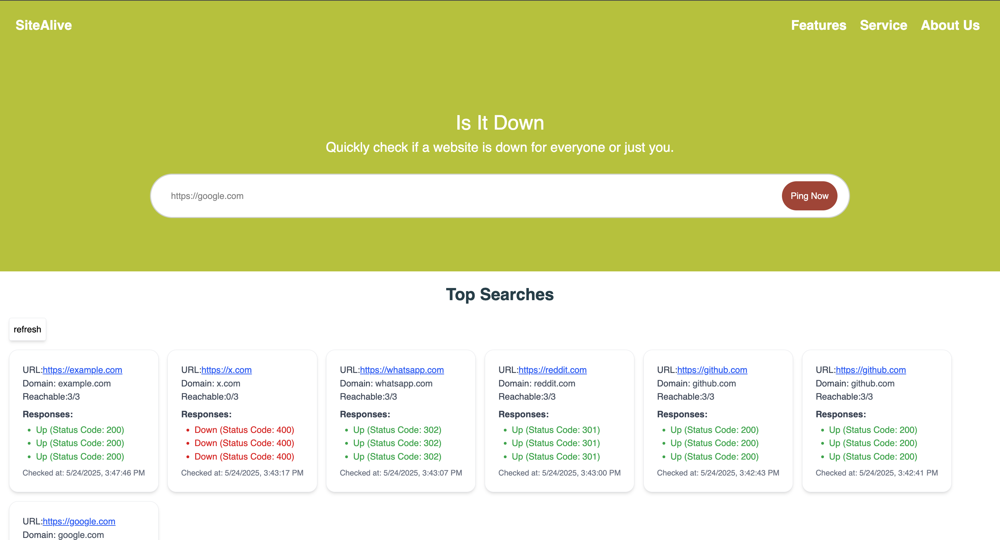

# SiteAlive

SiteAlive is a platform to check whether a website is up or down.

## Backend Setup

The backend consists of 1 main server and 3 distributed servers.

To start the backend:

```bash
cd servers
docker compose up
```

You can change the number of distributed server instances by editing the Docker Compose file. Both the main server and distributed servers are containerized. You can control the number of `d_server` instances directly in the Docker Compose configuration.

## Frontend Setup

To start the frontend:

```bash
cd client
npm install
npm run dev
```

The frontend runs on Vite and will be available locally on port 5173 by default.

## Notes

- The backend servers communicate over an internal Docker network.
- The distributed servers simulate real-world distributed checks by running on separate instances.

## Result 
